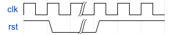
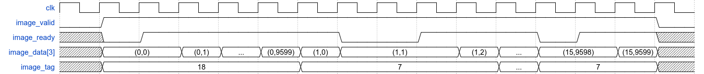

# Image Sorting Engine

## 說明
本實驗改自 103 學年 IC Contest B 組決賽競賽題目，該原始文件可從[此連結](http://icdc.ee.nsysu.edu.tw/history/2015/B/2015_B/B_ICC2015_all_cell-based_final.pdf)下載。

## 問題描述
請完成 Image Sorting Engine (ISE) 的電路設計以及驗證。此電路可將 16 張固定影像尺寸 (80x120) 之二維彩色影像訊號，作顏色的分類成紅色、綠色、藍色三大類別 (type)，並將其影像按照暗紅色...排列到亮紅色、暗綠色...排列到亮綠色、暗藍色...排列到亮藍色。排列後將影像所屬之類別 (type) 以及標籤 (tag) 值依序輸出。有關 ISE 詳細規格將描述於後。

## 輸入輸出介面

* `input clk`
	* 本系統為同步於時脈正緣之同步設計。（註: Host 端採 clk 正緣時送資料。）
* `input rst`
	* 低位準非同步 (active low asynchronous) 之系統重置信號。
* `input pixel_valid`
	* 指示輸入 `pixel_data` 資料為有效之控制訊號。當為 high 時，表示目前輸出的資料為有效的；反之，當為 low 時，表示目前輸出資料為無效的，即不被採用。
* `output pixel_ready`
	* ISE 可接受資料之控制訊號。當為 low 時，表示系統正處於忙碌階段，告知 host 端暫時停止 `pixel_data` 資料的輸入；反之，當為 high 時，表示告知 Host 端可繼續由 `pixel_in` 輸入資料。
* `input [7:0] pixel_data [3]`
	* ISE 影像 pixel 訊號之匯流排。Host 端會透過此匯流排將影像的所有 pixel 訊號進行輸入。每一個週期僅能輸入一組 pixel 值，且輸入過的 pixel 值無法再重複輸入。註：輸入訊號之 pixel 結構與其順序，請參照下方章節圖所示。
* `input [4:0] pixel_tag
	* ISE 影像訊號標籤 (tag) 之匯流排。Host 端會透過此匯流排將影像標籤輸入，在同一張影像的所有 pixel 輸入時該值不會變化，標籤並不保證不重複，若是有重複的情形，ISE 輸出重複之標籤即可。註：輸入訊號之 tag 結構與其順序請參照下方章節圖。
* `output o_valid`
	* 指示輸出資料為有效之控制訊號。當為 high 時，表示目前輸出的資料為有效的；反之，當為 low 時，表示目前輸出資料為無效的，即不被採用。
* `output [1:0] o_type`
	* ISE 影像顏色類別之輸出匯流排。指示 host 端，目前輸出的影像 index 值是屬於紅色類別則以 2\'b00 輸出、綠色類別則以 2\'b01 輸出、藍色類別則以 2\'b10 輸出。**注意：每一個週期僅能輸出一筆資料。**
* `output [4:0] o_tag`
	* ISE 影像綁定之 tag 值之輸出匯流排。當影像色彩分類與排序完成後，可透過此匯流排將各影像綁定之 tag 值依序輸出。**注意：每一個週期僅能輸出一筆資料。**

## 系統描述
### 輸入端彩色影像訊號
下圖為一張彩色影像，影像中的每一點訊號稱為 pixel，每個 pixel 是由色彩三元素 R (Red)、G (Green)、B (Blue) 三基色分量的強弱組合來決定一個 pixel 的顏色。例如：RGB 三基色分量(R,G,B) = (0,0,0)（即都最弱）時，該 pixel 會呈現黑色；當 RGB 三基色分量 (R,G,B) = (255,255,255)（即都最強）時，該 pixel 會呈現白色。因此調整 RGB 三基色分量的值，可以調出各式各樣的顏色，本題 RGB 皆以 8 位元無號整數表示（unsigned 8-bit 即訊號強度為 0~255），故彩色影像訊號的每個 pixel 由 3 個 8 位元信號表示輸入 ISE 電路，在 SystemVerilog 語法允許輸入輸出為多維度。本題影像尺寸為固定 120x80 個 pixels，其輸入順序係由左到右、上到下的順序（即如下圖所示，影像訊號輸入順序按照方格中之編號 0,1,2,3,4,...,9599），循序輸入至參賽者的 ISE 電路中。

注意:
1. 任何一個 pixel 之影像訊號只能讀取一次，並無反覆讀取之功能。
2. 讀取過程中，參賽者若想暫停影像訊號輸入，可以透過 `img_ready` 控制訊號設為 low 即可，再將 `img_valid` 控制訊號設為 high 即可繼續進行影像資料之讀取。本題 host 端會固定輸入 16 張彩色影像訊號，總共 120\*80\*16=153600 pixels。
3. ISE 影像訊號標籤 (tag) 不保證不重複，若是有重複的情形，ISE 輸出重複之標籤即可。

### ISE 電路運算方法
定義 pixel 以及影像的顏色由以下公式決定，pixel 的分類依照強度，影像的分類則是依照 pixel 數量決定。

* 條件
	* `RG = R >= G`
	* `RB = R >= B`
	* `GB = G >= B`
* 判定
	* `RG && RB` 則是紅色
	* `!RG && GB` 則是綠色
	* `!RB && !GB` 則是藍色

如前文所述，一張影像有 120x80 個 pixels，當每個 pixel 顏色皆判讀完後需依照其數量歸納該影像是屬於紅色類別或綠色類別或藍色類別。分類範例如下：假設某影像有 4500 R pixels, 4500 G pixels, 600 B pixels，由於 `RG` 跟 `RB` 成立，故此影像為紅色影像。

分類後之影像，需將其影像按照暗紅色...排列到亮紅色，暗綠色...排列到亮綠色，暗藍色...排列到亮藍色。其排列方法，本題規定如下：

* 當一張影像為紅色影像時，將該影像紅色 pixels 亮度加總平均。將所有紅色影像得出其紅色平均強度之後，由數值低到高排列，即是暗紅到亮紅。
* 所有藍色影像也用同規則，排列暗藍到亮藍。
* 所有綠色影像也用同規則，排列暗綠到亮綠。
* 若是有兩張影像類別和強度相同，則由先輸入者順序優先輸出。

假設有 7 張 80x120 之影像，其統計結果如下：

| Num. of R pixels | Num. of G pixels | Num. of B pixels | R pixels sum | G pixels sum | B pixels sum | Tag |
|-----------------:|-----------------:|-----------------:|-------------:|-------------:|-------------:|----:|
|             9000 |              300 |              300 |       450000 |         3000 |         3000 |  12 |
|                0 |             9600 |                0 |            0 |        14400 |            0 |   7 |
|             9000 |              600 |                0 |          900 |              |            0 |   7 |
|                0 |                0 |             9600 |            0 |            0 |       969696 |  13 |
|             3200 |             3200 |             3200 |        96000 |        25251 |        32000 |   0 |
|             3100 |             3400 |             3100 |            0 |       340000 |         3100 |   9 |
|             3100 |             3400 |             3100 |            0 |       340000 |         3100 |   2 |

經過前述公式處理之後，得到：

| Type  | Averge Intensity   | Tag |
|------:|-------------------:|----:|
|     0 |     450000/9000=50 |  12 |
|     1 |      4400/9600=1.5 |   7 |
|     0 |       900/9000=0.1 |   7 |
|     2 | 969696/9600=101.01 |  13 |
|     0 |      96000/3200=30 |   0 |
|     1 |    340000/3400=100 |   9 |
|     1 |    340000/3400=100 |   2 |

以下為排序完成之結果，即是 ISE 電路輸出順序：

| Type  | Averge Intensity (No output) | Tag |
|------:|-----------------------------:|----:|
|     0 |                          0.1 |   7 |
|     0 |                           30 |   0 |
|     0 |                           50 |  12 |
|     1 |                          1.5 |   7 |
|     1 |                          100 |   9 |
|     1 |                          100 |   2 |
|     2 |                         1.01 |  13 |

以上對應之 Python 程式碼，可以由在 `sim/` 執行 `python MyModel.py` 觀察，本次測試資料也是由 `MyModel.py` 直接輸入 ISE 電路測試。

### ISE 電路輸出順序
ISE 電路輸出順序為:
1. 紅色類別影像綁定之 tag 值，按照暗紅色...排列到亮紅色依序輸出。
1. 綠色類別影像綁定之 tag 值，按照暗綠色...排列到亮綠色依序輸出。
1. 藍色類別影像綁定之 tag 值，按照暗藍色...排列到亮藍色依序輸出。

每一筆影像 tag 值輸出時，需同時透過 ISE 電路之 `o_type` 腳位告知 host 端，目前輸出的影像綁定之是屬於紅色類別的給定 2\'b00，屬於綠色類別的給定 2\'b01，屬於藍色類別的給定 2\'b10。

注意:
1. 每一個週期只能輸出一組影像標籤 (tag) 值與色彩類別 (type) 值。
2. 當輸出的 `o_tag` 及 `o_type` 為有效的，需將 `o_valid` 訊號設為 1，反之則設為 0。
3. 本題之紅、綠、藍三大類別影像，其數量未必會一樣多，也可能某一類別從缺。
4. 假若兩數間之平均訊號強度非常接近時，需考量比較至小數位數的部分。
5. 小數位數的精確度，需足以區別出兩數之大小為止。

### ISE 時序規格
所有信號在 `rst` 拉高一次之後開始變動

### ISE 輸入時序規格
Reset 結束之後，Host 把 `pixel_valid` 變為 high 同時，送出第一筆 pixel 訊號及該 pixel 所屬之影像 tag 值，tag 值在同一張影像的時間內不會變動。雖然 ready/valid 信號對允許 valid 中途變為 low 停止輸入，但是本次電路規範中 valid 只有在送完 16 張影像共 153600 pixels 之後才會變回 low。假設參賽者需要暫停影像訊號輸入，可將 `pixel_ready` 拉為 low，Host `pixel_data` 以及 `pixel_tag` 的訊號便維持不變，如 (0,0), (1,1), (15,1598) 時間點所示，假設 ISE 需要繼續獲得下一筆 pixel，便將該訊號重新設為 high 即可（這是假設需要暫停輸入的範例，實做 ISE 電路時未必需要作暫停的動作）！另外，若是 `pixel_valid` 為 low 的時間，`pixel_ready` 要設為 high 或是 low 都可以。

### ISE 輸出時序規格
當參賽者完成 ISE 電路運算後，欲將資料輸出需將 `o_valid` 設為 high，告知 host 端有資料輸出，隨即便將紅色類別的影像 index/tag 值先做輸出、綠色類別隨後輸出，最後是藍色類別的影像。本題並未規定需要連續輸出，參賽者可自行控制 `o_valid` 控制訊號，要輸出就設為 high，不需輸出時設為 low 即可。當 32 筆資料輸出後，系統便會自動結束模擬並檢查。預設模擬時間約 250000 cycles，若屆時未達到 32 筆的資料輸出，系統將輸出 timeout 信號。

在取得所有輸入 pixel 之前就輸出資料是有效的，本規範中並無規範相依性，然而這需要 ISE 電路有預知能力才可能做到。

## 架構設計

### 名詞解釋
本題目輸入規範是標準的 valid/ready 信號的 handshake 格式（下稱 2-wire），輸出是標準的 valid 信號的 streaming 格式（下稱 1-wire）。假使能保證輸入資料不會「卡住」的情形下，用 1-wire，否則用 2-wire，僅用兩個格式便可以完成絕大多數的數位電路設計。

### 架構、速度分析
依照電路功能性可以直接把 ISE 區分為兩個部份，統計單張影像特性的 Counter 跟將之排序的 Sorter。

* Counter 輸入影像，輸出 average, type, count 等等給 Sorter。
* Sorter 輸入上述 average 等等，輸出排序好的 type 等等。

接著分析我們兩邊資料進出的速度是否足夠？要採用 1-wire 還是 2-wire？首先 Counter 可以從一張影像輸出得到一個資訊，這個資訊可以在一個 cycle 內輸出完畢，這就是說。Sorter 假設使用最簡單的 bubble sort 或是 insertion sort，可以在平方複雜度完成，如果有 16 個以上的 buffer，也不需要用比較麻煩的 2-wire 格式。況且因為一張影像輸入的時間接近 10000 個 cycle，可以在不用 buffer 的情形下採用 1-wire 資料格式。

* Counter 把輸入端影像控制 ready 信號固定為 high，把 2-wire 降級為 1-wire。
* Counter 輸入影像，用 1-wire 輸出 average, type, count 等等給 Sorter。
* Sorter 用 1-wire 接收上述 average 等等，用 1-wire 輸出排序好的 type 等等。
* Sorter 的相鄰 valid 中間必須有超過 50 個 cycle（可以依照需求自訂此數字，50 只是一個合理且可行的數字）。

## 測試樣本
提供一組 png 格式之測試樣本在 `sim/testdata` 下。

## 規格整理 (part 1)

* 本練習需要實做 Python testbench，請參考講義的文件完成。
* 本練習提供的工作站登入之後輸入 `tool 2` 可以取得 ncverilog 等等的必要工具。
* 本練習中在 `design/` 資料夾下已提供 Counter 跟 Sorter 之 functional model，part 2 必須把兩者改成可合成的 RTL 實做，part 1 只需在 ISE toplevel 下將兩者正確連結。
* 本練習中只提供 Sorter，由 Python 實做之的 testbench `Sorter_test.py`，ISE 以及 Counter 只提供模板，必須自行實做測試 `Top_test.py`, `Counter_test.py`。
* 本練習電路可以在 `sim/` 資料夾下，輸入以下命令分別測試 ISE, Counter, Sorter，由於上述理由，一開始只有 Sorter 可正確測試。
	* `make top`
	* `make sorter`
	* `make counter`
* 如果你想使用 Verilog 語法，我們也提供了 script。
	* `make USE_VERILOG=true top`
	* `make sorter`
	* `make counter`
* 要改寫的檔案列表如下（如果是用 SystemVerilog）：
	* `design/Top.sv`
	* `sim/Counter_test.py`
	* `sim/Top_test.py`
* 要改寫的檔案列表如下（如果是用 Verilog）：
	* `design/Top.v`
	* `sim/Counter_test.py`
	* `sim/Top_test.py`

## 規格整理 (part 2)
* 本練習提供的工作站登入之後輸入 `tool 2` 可以取得 ncverilog 等等的必要工具。
* 根據 ISE 電路規格，可分做「Counter 電路計算圖片類別、數量以及總強度」、「Sorter 電路排序 16 張圖片」來實做。
* 本練習中在 `design/` 資料夾下已提供 Counter 跟 Sorter 之 functional model，必須把兩者改成可合成的 RTL 實做，並在 ISE toplevel 下將兩者正確連結。
* 本練習電路可以在 `sim/` 資料夾下，輸入以下命令分別測試 ISE, Counter, Sorter，由於上述理由，一開始只有 Sorter 可正確測試。
	* `make top`
	* `make sorter`
	* `make counter`
* 如果你想使用 Verilog 語法，我們也提供了 script。
	* `make USE_VERILOG=true top`
	* `make USE_VERILOG=true sorter`
	* `make USE_VERILOG=true counter`
* 必須將完成之 ISE 電路通過 nLint 測試。
* 必須將完成之 ISE 電路合成通過測試。
* 要改寫的檔案列表如下（如果是用 SystemVerilog）：
	* `design/Sorter.sv`
	* `design/Counter.sv`
	* 請把 SystemVerilog 下面的 behaviour model 移除。
* 要改寫的檔案列表如下（如果是用 Verilog）：
	* `design/Sorter.v`
	* `design/Counter.v`
	* 請把 SystemVerilog 下面的 behaviour model 移除。
* 請完成 part 1 的這兩個檔案，如果不能完成的話，今天可以使用 part 1 同學完成的檔案：
	* `sim/Counter_test.py`
	* `sim/Top_test.py`
* Gate level 模擬需要將檔案放在 `syn/Top_syn.sv` 下，並執行：
	* `make SYN=true top`
